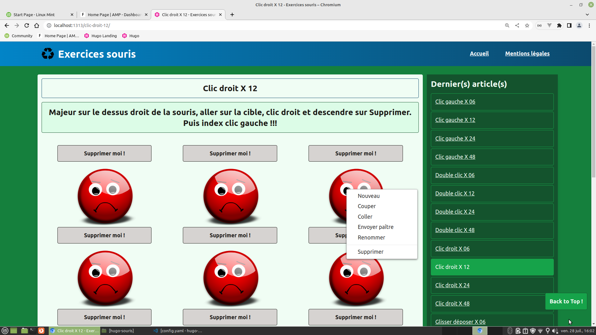

# Hugo Souris

Site d'exercices souris réalisé avec le générateur de site [Hugo](https://gohugo.io/), ainsi que le framework [jQuery](https://jquery.com/) et l'extension [jQuery contextMenu](http://swisnl.github.io/jQuery-contextMenu/). Toutes les fonctionnalités n'ont pas encore été développées.

Mouse exercise site made with the [Hugo](https://gohugo.io/) site generator, as well as the [jQuery](https://jquery.com/) framework and the [jQuery contextMenu](http://swisnl.github.io/jQuery-contextMenu/) extension. Not all features have been developed yet.

## Installation

## Usage

## Contributing
[makeareadme](https://www.makeareadme.com/)

## License
[Unlicense](https://choosealicense.com/licenses/unlicense/)
